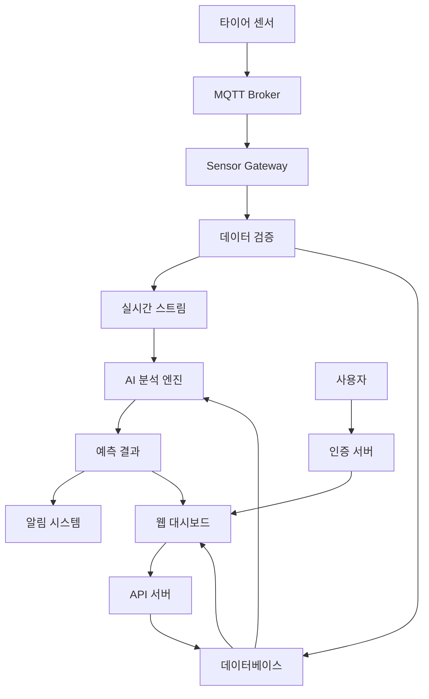

# 🚗 HankookTire SmartSensor 2.0

**차세대 통합 스마트 타이어 센서 시스템**

실시간 타이어 모니터링과 예측 분석을 통한 스마트 차량 관리 솔루션

---

## 🌟 시스템 개요

HankookTire SmartSensor 2.0은 기존의 로딩/스태킹 프로젝트, 타이어 압력 모니터링 시스템, 실시간 데이터 수집 프로젝트를 통합하여 개발된 차세대 스마트 타이어 센서 플랫폼입니다.

### 핵심 기능

- **🔄 실시간 모니터링**: 압력, 온도, 진동 데이터 실시간 수집
- **🤖 AI 기반 예측**: 머신러닝을 통한 타이어 상태 예측 및 이상 탐지
- **📊 통합 대시보드**: 실시간 데이터 시각화 및 분석
- **🔒 엔터프라이즈 보안**: OAuth2 인증, AES-256 암호화, RBAC
- **⚡ 고성능 처리**: Kubernetes 기반 확장 가능한 마이크로서비스
- **🛡️ 자가 치유**: 자동 복구 및 장애 대응 시스템

### 시스템 아키텍처

```
┌─────────────────┐  ┌─────────────────┐  ┌─────────────────┐
│   센서 네트워크    │  │   데이터 수집     │  │   AI 분석 엔진   │
│                │  │                │  │                │
│ • 압력 센서      │→ │ • MQTT 브로커   │→ │ • 예측 모델      │
│ • 온도 센서      │  │ • 데이터 파이프라인│  │ • 이상 탐지      │
│ • 진동 센서      │  │ • 실시간 스트리밍 │  │ • 패턴 분석      │
└─────────────────┘  └─────────────────┘  └─────────────────┘
         │                      │                      │
         ▼                      ▼                      ▼
┌─────────────────────────────────────────────────────────────┐
│                    Kubernetes 오케스트레이션                  │
│                                                           │
│  ┌──────────────┐ ┌──────────────┐ ┌──────────────┐      │
│  │  웹 대시보드   │ │   API 서버    │ │  모니터링     │      │
│  │              │ │              │ │              │      │
│  │ • React UI   │ │ • RESTful API│ │ • Prometheus │      │
│  │ • 실시간 차트  │ │ • GraphQL    │ │ • Grafana    │      │
│  │ • 알림 센터   │ │ • WebSocket  │ │ • AlertManager│     │
│  └──────────────┘ └──────────────┘ └──────────────┘      │
└─────────────────────────────────────────────────────────────┘
```

## 🚀 빠른 시작

### 사전 요구사항

- **Kubernetes**: v1.20 이상
- **Docker**: v20.10 이상
- **Helm**: v3.7 이상 (선택사항)
- **kubectl**: 최신 버전
- **Python**: 3.9 이상
- **Node.js**: 16 이상 (프론트엔드 개발용)

### 1단계: 시스템 배포

```bash
# 1. 저장소 클론
git clone https://github.com/hankooktire/smartsensor-2.0.git
cd smartsensor-2.0

# 2. 환경 설정
export NAMESPACE="hankook-smartsensor"
export SECURITY_NAMESPACE="hankook-security"
export MONITORING_NAMESPACE="monitoring"

# 3. 기본 인프라 배포
cd deployment
chmod +x *.sh
./setup-infrastructure.sh

# 4. 보안 시스템 설정
cd ../security/scripts
./security-setup.sh

# 5. 모니터링 시스템 구축
cd ../../monitoring/scripts
./setup-monitoring.sh

# 6. 성능 최적화 실행
cd ../../performance/scripts
./performance-suite.sh
```

### 2단계: 서비스 접속

#### 웹 대시보드
```bash
# 포트포워딩
kubectl port-forward -n hankook-smartsensor svc/web-dashboard 3000:80

# 브라우저에서 접속
http://localhost:3000
```

#### API 서버
```bash
# 포트포워딩
kubectl port-forward -n hankook-smartsensor svc/api-server 8000:8000

# API 테스트
curl http://localhost:8000/api/health
```

#### 모니터링 대시보드
```bash
# Grafana 접속
kubectl port-forward -n monitoring svc/grafana 3001:3000

# 기본 로그인: admin / admin
http://localhost:3001
```

## 📖 문서 구조

### 사용자 가이드
- [**사용자 가이드**](./user-guide/README.md) - 시스템 사용 방법
- [**대시보드 가이드**](./user-guide/dashboard-guide.md) - 웹 인터페이스 사용법
- [**모바일 앱 가이드**](./user-guide/mobile-guide.md) - 모바일 애플리케이션

### 운영 가이드
- [**설치 가이드**](./installation/README.md) - 상세 설치 방법
- [**운영 가이드**](./operations/README.md) - 시스템 운영 및 관리
- [**모니터링 가이드**](./monitoring/README.md) - 성능 모니터링 및 알림
- [**보안 가이드**](./security/README.md) - 보안 설정 및 관리

### 개발자 가이드
- [**API 문서**](./api/README.md) - REST API 및 GraphQL 문서
- [**개발 가이드**](./development/README.md) - 개발 환경 구성
- [**아키텍처 문서**](./architecture/README.md) - 시스템 아키텍처
- [**기여 가이드**](./contributing/README.md) - 개발 참여 방법

### 문제 해결
- [**FAQ**](./troubleshooting/faq.md) - 자주 묻는 질문
- [**문제 해결 가이드**](./troubleshooting/README.md) - 일반적인 문제 해결
- [**성능 튜닝**](./troubleshooting/performance-tuning.md) - 성능 최적화

## 🔧 시스템 구성 요소

### 핵심 서비스

| 서비스 | 포트 | 설명 | 상태 모니터링 |
|--------|------|------|---------------|
| **API Server** | 8000 | 주요 REST API 서버 | `/health` |
| **Web Dashboard** | 80 | React 기반 웹 인터페이스 | `/` |
| **Sensor Gateway** | 8080 | IoT 센서 데이터 게이트웨이 | `/status` |
| **Analytics Engine** | 8888 | AI/ML 분석 엔진 | `/metrics` |
| **MQTT Broker** | 1883 | 센서 데이터 메시징 | TCP 연결 |

### 보안 서비스

| 서비스 | 포트 | 설명 |
|--------|------|------|
| **OAuth2 Server** | 8001 | JWT 기반 인증 서버 |
| **Crypto Manager** | 8005 | 암호화 키 관리 |
| **Network Security** | 8003 | 방화벽 및 침입 탐지 |

### 모니터링 서비스

| 서비스 | 포트 | 설명 |
|--------|------|------|
| **Prometheus** | 9090 | 메트릭 수집 |
| **Grafana** | 3000 | 대시보드 및 시각화 |
| **AlertManager** | 9093 | 알림 관리 |
| **Elasticsearch** | 9200 | 로그 저장 |
| **Kibana** | 5601 | 로그 분석 |

## 📊 데이터 플로우



## 🔒 보안 기능

### 인증 및 인가
- **OAuth2/JWT**: 토큰 기반 인증
- **RBAC**: 세분화된 역할 기반 접근 제어
- **MFA**: 다단계 인증 지원

### 데이터 보호
- **AES-256**: 저장 데이터 암호화
- **TLS 1.3**: 전송 데이터 암호화
- **키 순환**: 자동 암호화 키 갱신

### 네트워크 보안
- **방화벽**: IP 기반 접근 제어
- **DDoS 방어**: 자동 공격 탐지 및 차단
- **지역 차단**: 지리적 접근 제한

## 📈 성능 특성

### 처리 성능
- **데이터 처리량**: 100만 센서 이벤트/분
- **API 응답 시간**: 평균 <100ms
- **실시간 분석**: <1초 지연

### 확장성
- **수평 확장**: Kubernetes HPA 지원
- **자동 스케일링**: CPU/메모리 기반
- **로드 밸런싱**: 서비스 메시 지원

### 가용성
- **업타임**: 99.9% SLA
- **장애 복구**: 자동 복구 <5분
- **백업**: 자동 일일 백업

## 🚨 알림 및 모니터링

### 실시간 알림
- **타이어 압력 이상**: 임계값 초과 시 즉시 알림
- **온도 과열**: 위험 온도 도달 시 경고
- **시스템 장애**: 서비스 다운 시 알림

### 모니터링 대시보드
- **실시간 메트릭**: 시스템 성능 지표
- **커스텀 대시보드**: 사용자 정의 뷰
- **히스토리 분석**: 과거 데이터 트렌드

## 🛠️ 개발 환경

### 로컬 개발
```bash
# 개발 환경 설정
cd development
./setup-dev-environment.sh

# 로컬 서비스 실행
docker-compose up -d

# 테스트 실행
npm test
pytest tests/
```

### CI/CD 파이프라인
- **GitHub Actions**: 자동 빌드 및 테스트
- **Docker**: 컨테이너 이미지 빌드
- **Kubernetes**: 자동 배포

## 📞 지원 및 연락처

### 기술 지원
- **이메일**: support@hankook-smartsensor.com
- **문서**: https://docs.hankook-smartsensor.com
- **이슈 트래커**: https://github.com/hankooktire/smartsensor-2.0/issues

### 팀 연락처
- **DevOps 팀**: devops@hankook-smartsensor.com
- **보안 팀**: security@hankook-smartsensor.com
- **제품 팀**: product@hankook-smartsensor.com

## 📋 라이선스

이 프로젝트는 HankookTire의 독점 소프트웨어입니다. 
자세한 내용은 [LICENSE](./LICENSE) 파일을 참조하세요.

## 🔄 업데이트 로그

### v2.0.0 (2024-01-26)
- ✨ 차세대 통합 시스템 출시
- 🔒 엔터프라이즈 보안 기능 추가
- 🤖 AI 기반 예측 분석 구현
- ⚡ 성능 최적화 및 자동 확장
- 📊 고급 모니터링 대시보드

---

**© 2024 HankookTire SmartSensor 2.0. All rights reserved.**